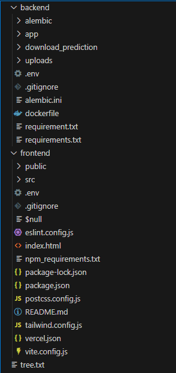

# Ⅰ. 프로젝트 개요
> **SmartStock AI**는 ERP/WMS가 없어도  
> **CSV/Excel 업로드만으로 “정제 → 예측 → 발주정책(EOQ/ROP/SS) → KPI 시각화”**  
> 까지 한 번에 처리하는 **AI 재고관리 SaaS 프로토타입**입니다.   
> 프론트엔드(React) – 백엔드(FastAPI) – 예측엔진(TensorFlow LSTM+CNN) – 데이터베이스(MySQL)를  
> **도커 기반 클라우드 환경**에 통합하여,  
> 비전문가도 클릭 몇 번으로 수요예측과 발주 의사결정을 수행할 수 있도록 설계했습니다.  
> <br>

---

## 1. 핵심 가치 제안 (Value Proposition)
- **즉시 사용 가능**: 로그인 없이 시작, CSV/Excel 업로드만으로 자동 정제·예측 실행  
- **정확도 중심 설계**: **LSTM+CNN 하이브리드**로 SKU 단기 예측, 성능/버전은 **MLflow**로 추적  
- **운영 효율화**: 발주정책(SS/ROP/Q)을 자동 산출하여 **수작업을 대폭 축소**하고 리스크(품절/과잉)를 대시보드로 즉시 파악
> <br>

---

## 2. 사용 시나리오 (End-to-End Flow)
- **데이터 업로드**: CSV/Excel 업로드 → 자동 컬럼 인식·결측/이상치 보정·스키마 표준화  
- **AI 예측**: SKU/카테고리 단기 예측(**LSTM+CNN**) 수행, 예측분위수(p10/p50/p90) 활용  
- **정책 계산**: 수요 분산·리드타임을 반영해 **SS, ROP, Q** 산출 및 **PO Draft** 생성  
- **시각화·의사결정**: KPI/리스크 대시보드, Pandas GUI Studio, Copilot 질의응답으로 설명 가능성 강화
> <br>

---

## 3. 목표 및 성과 (KPI)
- **목표**: WAPE ≤ 15%, Fill Rate ≥ 95%, 품절률 ≤ 2%, 클릭 3회 내 주요 작업 완료  
- **검증 결과(프로토타입)**: **WAPE 14.2%**, **Fill Rate 96.3%**, **품절률 1.8%**, 사용자 작업시간 **약 70% 절감**
> <br>

---

## 4. 차별화 포인트 (Why Now / Why Us)
- **Human–AI Co-Lab**: 사용자의 최종 결정과 AI 제안을 비교·학습하는 **피드백 루프**로 정책 품질을 지속 개선  
- **설명가능·감사가능**: KPI 카드, 리스크 위젯, 정책 수식 공개로 **투명한 의사결정** 지원  
- **확장 로드맵**: **Transformer/TFT**, **Auto-Retraining(Airflow+MLflow)**, **ERP/WMS API**, **멀티테넌트 보안(RLS/JWT)** 계획 반영
> <br>

---

## 5. 기술 개요 (Tech Snapshot)
- **Frontend**: React(Next/Vite), Tailwind, Chart.js/Recharts  
- **Backend**: FastAPI(Python), OpenAPI/Swagger, Pydantic Validation  
- **AI/ML**: TensorFlow **LSTM+CNN** 하이브리드, 슬라이딩 윈도우, MLflow 트래킹  
- **Data/Infra**: MySQL, Docker, AWS EC2/RDS, Colab 학습 파이프라인
> <br>

---

- 실제 실행 화면


<br><br>

## Ⅱ. 주요 기능
> SmartStock AI는 데이터 업로드부터 예측, 정책 계산, 시각화, 의사결정 지원까지  
> 전 과정을 자동화한 **AI 재고관리 SaaS 플랫폼**입니다.  
> 아래는 시스템 구성과 핵심 기능 체계입니다.  
> <br>

---

### 1. 데이터 워크스페이스 (Data Workspace)
- CSV/Excel 업로드 시 자동 컬럼 인식 및 **데이터 클렌징** 수행  
- **결측치·이상치·중복 데이터 자동 탐지 및 보정**  
- 정제 결과 리포트 제공 (품질 요약, 컬럼 매핑 상태 등)  
- 전처리 결과를 **예측 엔진 입력 포맷(LSTM/CNN)** 으로 자동 변환  
<br>

---

### 2. AI 예측 및 정책 계산 (Forecast & Policy Engine)
- **TensorFlow LSTM+CNN 하이브리드 모델** 기반 시계열 예측  
- SKU·카테고리별 **7일 단기 예측 수행**  
- 예측 결과의 분위수(p10/p50/p90)를 활용해 **SS·ROP·EOQ 자동 산출**  
- 발주 정책 계산 결과를 **PO Draft 형태로 자동 생성**  
- **MLflow**를 통한 모델 버전 관리 및 성능 추적  
<br>

---

### 3. AI 챗봇 (LLM Agent & Copilot)
- **재고관리 특화 LLM 에이전트** 탑재  
- **자연어 질의**로 재고 상태 조회, 예측 결과 해석, 발주 시뮬레이션 가능  
- AI 제안 기반 정책 추천 / 리포트 자동 생성  
- **권한 기반 질의 제한** 및 **PII 마스킹 적용**으로 보안 강화  
<br>

---

### 4. Human–AI Co-Lab (협업 피드백 루프)
- AI 발주 제안과 사용자의 실제 의사결정 결과를 비교  
- **정확도(WAPE, RMSE, Fill Rate)** 중심 성과 피드백  
- 사용자 피드백을 AI 학습 루프에 반영해 정책 품질 지속 개선  
<br>

---

### 5. 대시보드 & 리스크 모니터링 (Visualization & Monitoring)
- **KPI 대시보드**: 재고일수·Fill Rate·품절률·과잉률 등 시각화  
- **리스크 경고 시스템**: 품절/과잉/리드타임 리스크 실시간 알림  
- **정책 시뮬레이션**: EOQ·ROP·SS 조합별 비교 및 분석  
- **라인리지 관리**: 로그, 모델 버전, 정책 변경 내역 추적  
<br>

---

### 6. 사용자 스토리 기반 워크플로 (User Scenario)
- **Planner:** CSV 업로드 → 자동 정제 리포트 확인  
- **Buyer:** 예측 결과 확인 → SS·ROP 기반 발주 제안 검토  
- **Manager:** 품절·과잉 리스크 대시보드로 실시간 모니터링  
- **Data Expert:** 예측 성능 모니터링 및 파라미터 조정  
- **AI Copilot:** 자연어 질의로 재고 상태 및 예측 결과 조회  

<br><br>

## Ⅲ. 시스템 아키텍처 (System Architecture)
> SmartStock AI는 Frontend–Backend–AI Model–Database를  
> **FastAPI + TensorFlow + MySQL + Docker + AWS** 기반으로 통합한 구조입니다.  
> <br>


<br><br>
## Ⅳ. 기술 스택 (Tech Stack)
> SmartStock AI는 **React + FastAPI + TensorFlow + MySQL + Docker** 기반으로  
> 클라우드 환경에서 통합 운영되는 AI 재고관리 SaaS 프로토타입입니다.  
> <br>

| **영역** | **기술 구성** |
|:--|:--|
| **Frontend** | React (**Vite**, **Tailwind CSS**, **Chart.js**, **Recharts**) |
| **Backend** | FastAPI (**Python 3.10**), **Pydantic Schema Validation** |
| **AI Model** | **TensorFlow LSTM + CNN Hybrid** (시계열 예측 엔진) |
| **DB / Infra** | **MySQL 8.0**, **Docker**, **AWS EC2**, **MLflow** |
| **Version Control** | **GitHub**, **GitHub Actions** (CI/CD) |
| **Collaboration** | **Notion**, **Slack**, **Colab** |

<br>

## Ⅴ. 성능 결과 (Performance Results)
> SmartStock AI는 실제 테스트 데이터 기준으로 예측 정확도와 운영 효율성 측면에서  
> 목표 대비 우수한 성능을 달성했습니다.  
> <br>

<table>
  <thead style="background-color:#F6F8FA;">
    <tr>
      <th style="text-align:center; padding:8px;">지표</th>
      <th style="text-align:center; padding:8px;">목표</th>
      <th style="text-align:center; padding:8px;">결과</th>
    </tr>
  </thead>
  <tbody>
    <tr style="background-color:#FFFFFF;">
      <td style="text-align:center; padding:8px;"><b>WAPE</b></td>
      <td style="text-align:center; padding:8px;">≤ 15%</td>
      <td style="text-align:center; padding:8px; background-color:#E8F4FF;"><b>14.2%</b></td>
    </tr>
    <tr style="background-color:#FFFFFF;">
      <td style="text-align:center; padding:8px;"><b>Fill Rate</b></td>
      <td style="text-align:center; padding:8px;">≥ 95%</td>
      <td style="text-align:center; padding:8px; background-color:#E8F4FF;"><b>96.3%</b></td>
    </tr>
    <tr style="background-color:#FFFFFF;">
      <td style="text-align:center; padding:8px;"><b>품절률</b></td>
      <td style="text-align:center; padding:8px;">≤ 2%</td>
      <td style="text-align:center; padding:8px; background-color:#E8F4FF;"><b>1.8%</b></td>
    </tr>
    <tr style="background-color:#FFFFFF;">
      <td style="text-align:center; padding:8px;"><b>작업시간 단축</b></td>
      <td style="text-align:center; padding:8px;">–</td>
      <td style="text-align:center; padding:8px; background-color:#E8F4FF;"><b>70% 절감</b></td>
    </tr>
  </tbody>
</table>

<br>

>  **결론 요약:**  
> - 예측 정확도(WAPE)는 **목표 15% 이하 → 실제 14.2% 달성**  
> - Fill Rate는 **96.3%** 로 목표 초과 달성  
> - 품절률은 **1.8%** 로 기준 2% 이하 유지  
> - 데이터 자동정제 및 발주정책 자동화로 **작업시간 70% 절감**

<br><br>
## Ⅵ. 폴더 구조 (Folder Tree)
> SmartStock AI의 전체 프로젝트 구조는 **Frontend / Backend / AI / Infra** 중심으로 구성되어 있습니다.  
> 주요 폴더별 역할만 요약하여 표시했습니다.  
> <br>


> **구조 요약**
> - **backend/** → API 서버, DB 모델, 서비스 로직  
> - **frontend/** → 대시보드 UI, 데이터 시각화  
> - **ai/** → 예측 모델 학습/추론 파이프라인  
> - **infra/** → Docker, Nginx, 배포 환경  
> - **docs/** → 사용자/개발자 문서  
> - **tests/** → 모듈별 테스트 코드  

---



<br><br>
## Ⅶ. 실행 방법 (How to Run)
> SmartStock AI는 **FastAPI (Backend)** 와 **React/Vite (Frontend)** 로 구성되어 있으며,  
> 아래 명령어를 순서대로 실행하면 로컬 환경에서 전체 서비스를 구동할 수 있습니다.  
> <br>

---

### 🚀 **실행 절차**

```bash
# 1️⃣ 백엔드 & 프론트엔드 통합 실행 절차

# (1) 백엔드 설정 및 실행
cd backend
pip install -r requirements.txt
uvicorn main:app --reload

# (2) 프론트엔드 설정 및 실행
cd ../frontend
npm install
npm run dev
```

>  **접속 경로**
> - **Backend (FastAPI):** http://127.0.0.1:8000  
>   ↳ Swagger API 문서: http://127.0.0.1:8000/docs  
> - **Frontend (React/Vite):** http://localhost:5173  
>   ↳ 웹 대시보드에서 실시간 API 연동 가능  
> <br>

---

>  **설명:**  
> - Docker 실행 시 Backend, Frontend, MySQL, MLflow 컨테이너가 동시에 구동됨  
> - 브라우저에서 `localhost:5173` 접속 시 SmartStock AI 대시보드 자동 로드  
> - FastAPI, MLflow, DB 연결이 자동 구성되므로 환경 변수 충돌 방지  
> <br>

---

>  **실행 순서 요약**
> 1. `cd backend && uvicorn main:app --reload`  
> 2. 새 터미널에서 `cd frontend && npm run dev`  
> 3. 브라우저에서 `localhost:5173` 접속  
> 4. Swagger UI로 API 확인 (`127.0.0.1:8000/docs`)  
