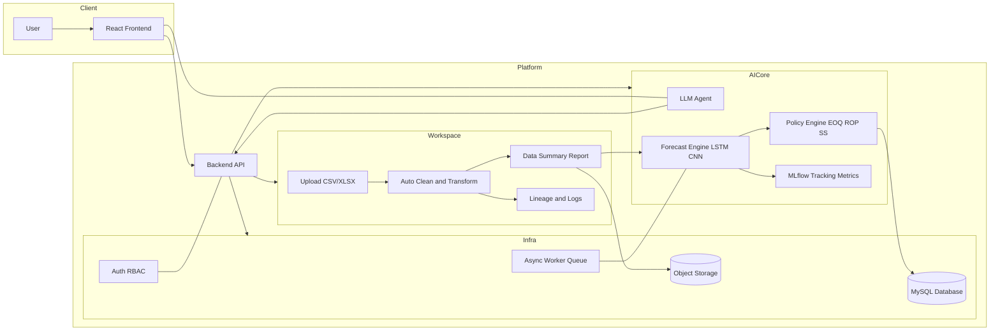

# SmartStock AI — Phase 3

## 프로젝트 개요
AI 기반 재고관리 SaaS 프로토타입 구축을 목표로 한다.  
데이터 자동 정제, 예측 정확도 향상, 재고 효율 개선을 통해 운영 효율화와 비용 절감을 추구한다.  
주요 기능은 데이터 업로드 및 정제, AI 예측·정책 계산, 대시보드 시각화이며,  
사용자–AI 협업을 통해 데이터 품질과 분석 효율을 극대화한다.

---

## 프로젝트 정보
- **상태:** 완료  
- **우선순위:** 높음  
- **담당자:** 황재성/이유진/박성호 
- **기간:** 2025.10.17 ~ 2025.10.20  
- **목표:** MLOps-ready 백엔드 기반 AI 재고관리 SaaS 프로토타입 구축  

---

## 1️⃣ 프로젝트 개요
ERP/WMS 연동이 어려운 기업도 자체 판매 데이터를 업로드하면  
→ 자동 정제 → 예측 → 발주 추천까지 전 과정을 자동화하는 AI 기반 재고관리 플랫폼을 구축한다.

**환경 구성**
- Colab + FastAPI + MySQL + TensorFlow (LSTM)
- Python 기반 예측·최적화 엔진 중심의 SaaS 프로토타입

---

## 2️⃣ 프로젝트 목표

| 구분 | 세부 목표 |
|------|------------|
| 데이터 자동정제 | 업로드 시 결측치·이상치·중복 자동 탐지 및 처리 |
| 예측정확도 | 상위 SKU 기준 WAPE ≤ 15%, Fill Rate ≥ 95% |
| 재고효율 | 불필요 재고 20% 감소, 품절률 2% 이하 |
| 운영편의성 | 클릭 3번으로 분석 및 발주추천 수행 |
| 전문가 커스터마이징 | Pandas GUI형 시각화/변환 스튜디오 제공 |

---

## 3️⃣ 시스템 구성

**데이터 흐름**  
Excel/CSV 업로드 → 자동정제 → AI 예측 → 발주정책 계산 → 대시보드 시각화  

**구성 요소**
- Frontend: React (TypeScript, Vite/Next.js), Tailwind CSS, Chart.js/Recharts  
- Backend: FastAPI (Python)  
- Model: LSTM + CNN Hybrid Forecasting Engine  
- DB: MySQL  
- Infra: Docker, AWS EC2/RDS, Colab

---

## 4️⃣ 주요 기능

### 1. 데이터 업로드 및 정제
- Excel/CSV 업로드 시 자동 컬럼 감지 및 결측치 처리  
- 업로드 직후 데이터 상태 리포트 자동 생성

### 2. 컬럼 인식 및 데이터 클렌징
- SKU, 입출고량, 재고수준, 날짜 컬럼 자동 식별  
- 시계열 구조 변환 및 단위 정규화 처리  
- 피처셋 자동 확정 후 예측 엔진으로 전달

### 3. AI 예측 및 정책 계산
- 예측 엔진: TensorFlow 기반 LSTM + CNN 하이브리드 모델  
- 전략: SKU·카테고리 단위 시계열 슬라이딩 윈도우 / 롤링 백테스트(WAPE/sMAPE)  
- 불확실성 추정: 분위수(p10/p50/p90) 기반 안전재고·재주문점 산출  
- 정책 계산: EOQ/ROP/SS 공식 기반 자동 발주량(Q) 계산  
- 모델 관리: MLflow 기반 학습 결과·메트릭 버전 관리

### 4. 대시보드 시각화
- KPI 카드(WAPE, Fill Rate, 재고일수)  
- 품절·과잉재고 하이라이트  
- 발주추천서 Excel 자동 생성  
- Pandas GUI 기반 데이터 변환·피벗·차트 구성 기능  

---

## 5️⃣ 핵심 알고리즘 및 KPI

**재고 정책 공식**
```
안전재고(SS) = z * σ_demand * sqrt(L)
재주문점(ROP) = μ_demand * L + SS
발주량(Q) = max(0, ROP + 목표재고 - 현재가용재고)
```

| 항목 | 정의 | 목표 |
|------|------|------|
| WAPE | 예측 오차율 | ≤ 15% |
| Fill Rate | 판매 충족률 | ≥ 95% |
| Stockout Rate | 품절률 | ≤ 2% |
| Days of Supply | 재고일수 | ≤ 30일 |

---

## 6️⃣ 기대효과

| 구분 | 기대효과 | 설명 |
|------|-----------|------|
| 운영 효율화 | 재고관리 자동화 | 수작업 대비 70% 시간 단축 |
| 정확도 향상 | 예측오차 20~30% 감소 | LSTM + CNN 적용 |
| 비용 절감 | 과잉재고 20% 감소 | 발주정책 최적화 |
| 리스크 감소 | 품절률 2% 이하 | 안전재고 자동 유지 |
| 확장성 | 멀티테넌트 SaaS 확장 | 다수 고객사 동시 운영 가능 |

---

## 7️⃣ 기능 정의 (Functional Definition)

### 플랫폼 방향성
> “AI + Human 협업형 데이터 워크스페이스”  
> 재고 담당자는 LLM 에이전트를 통해 자연어로 질의·분석·의사결정 가능하며,  
> 데이터 전문가는 코드 및 파라미터 조정을 통해 모델 검증과 튜닝이 가능하다.

### 사용자 스토리

| 사용자 | 주요 목적 | 핵심 행위 |
|---------|-----------|-----------|
| Planner | 데이터 업로드 및 정제 | CSV 업로드 → 컬럼 인식 → 결측 보정 |
| Buyer | 예측 기반 발주 | 예측 결과 확인 → 발주 제안 검토 |
| Manager | 리스크 모니터링 | 품절/과잉 리스크 확인 및 KPI 검토 |
| Data Expert | 모델 검증 | 성능 모니터링 및 재학습 |
| AI Copilot | 설명 및 요약 | 자연어 질의 응답, 정책 추천 |

---

## 8️⃣ 시스템 기능 체계

### A. 데이터 워크스페이스
- CSV/Excel 업로드 및 자동 클렌징  
- 이상치·중복 탐지 및 자동 보정  
- 정제 결과 리포트 및 전처리 포맷 변환  

### B. AI 챗봇 (LLM Agent)
- 재고관리 특화 자연어 인터페이스  
- 예측 해석, 발주 시뮬레이션, 정책 추천 자동화  
- 권한별 접근제어 및 개인정보 마스킹  

### C. 예측 및 최적화
- LSTM + CNN 기반 시계열 예측  
- EOQ/ROP/SS 기반 발주정책 계산  
- MLflow 기반 재학습 및 성능 추적  

### D. Human–AI Co-Lab
- AI 제안 vs 사용자 결정 성과 비교  
- 피드백 루프를 통한 정책 개선  

### E. 대시보드 & 리스크 모니터링
- KPI 보드, 리스크 알림, 시나리오 비교  
- 정책별 EOQ·ROP·SS 시뮬레이션  
- 모델 버전 및 라인리지 관리  

---

## 9️⃣ 향후 개선 방향
- 외부 요인 반영 (날씨, 시즌, 프로모션 등)  
- LLM 에이전트 고도화 (Copilot 기능 강화)  
- Transfer Learning 통한 데이터 희소성 보완  
- 자동 재학습 파이프라인 구축  
- ERP/WMS API 연동  
- Slack/Email 등 협업툴 통합  

---

## 10️⃣ 아키텍처 다이어그램



---

## License
본 프로젝트의 코드 및 문서는 교육용·비영리 연구 목적으로 자유롭게 활용할 수 있다.  
상업적 이용 시 별도의 협의가 필요하다.
